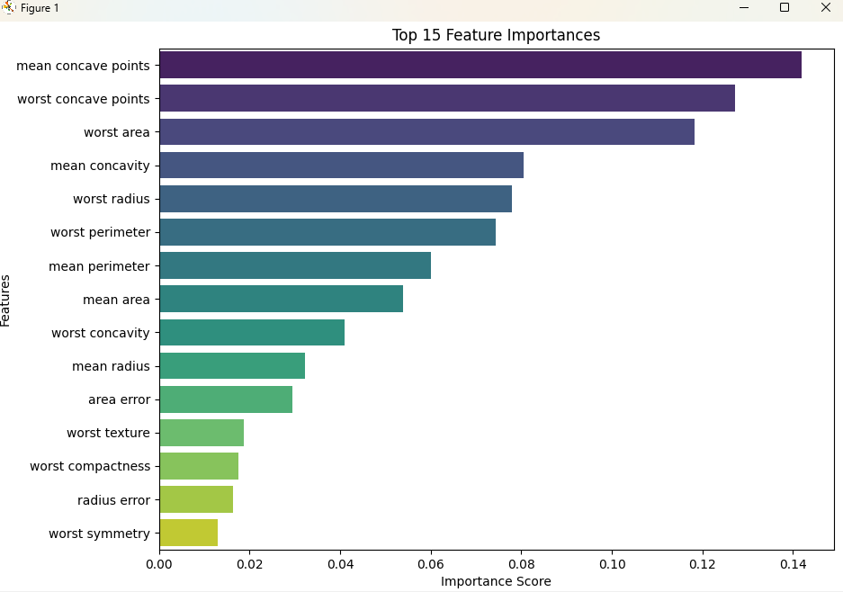

# Breast Cancer Classification with Random Forest 🌳


A complete machine learning project that uses a Random Forest classifier to predict whether a breast cancer tumor is malignant or benign based on the Wisconsin Diagnostic Breast Cancer (WDBC) dataset.

## 🌲 About The Project

This repository provides a step-by-step implementation of a Random Forest model. The goal is to demonstrate a standard machine learning workflow, including:

- 📊 **Data Loading & Exploration:** Using `pandas` to load and understand the data.
- ⚙️ **Data Preprocessing:** Splitting the data into training and testing sets.
- 🧠 **Model Training:** Building and training a `RandomForestClassifier` with `scikit-learn`.
- 📈 **Performance Evaluation:** Assessing the model with metrics like accuracy, a confusion matrix, and a classification report.
- ✨ **Feature Importance:** Identifying which features are most influential in the model's predictions.

## 📁 File Structure

The repository is organized to keep code, models, and outputs separate and clean.

```
.
├── .gitignore
├── README.md
├── requirements.txt
├── scripts/
│ └── train_model.py
├── outputs/
│ └── plots/
│ ├── confusion_matrix.png
│ └── feature_importance.png
└── models/
    └── random_forest_model.joblib
```

## 🚀 Getting Started

Follow these instructions to get a copy of the project up and running on your local machine.

### Prerequisites

- Python 3.9 or newer
- `pip` and `venv`

### Installation & Usage

1. **Clone the repository:**
    ```sh
    git clone [https://github.com/your-username/breast-cancer-random-forest.git](https://github.com/your-username/breast-cancer-random-forest.git)
    cd breast-cancer-random-forest
    ```

2. **Create and activate a virtual environment:**
    * On macOS/Linux:
        ```sh
        python3 -m venv venv
        source venv/bin/activate
        ```
    * On Windows:
        ```sh
        python -m venv venv
        .\venv\Scripts\activate
        ```

3. **Install the required libraries:**
    ```sh
    pip install -r requirements.txt
    ```

4. **Run the training script:**
    ```sh
    python scripts/train_model.py
    ```
    This will train the model, run the evaluation, and save the model file and output plots to the `model/` and `output/` directories.

## ✅ Results

The model performs exceptionally well on the test set, achieving an accuracy of **97.08%**.

### Classification Report

| | precision | recall | f1-score | support |
| :------------ | :-------: | :----: | :------: | :-----: |
| **malignant** | 0.98 | 0.94 | 0.96 | 63 |
| **benign** | 0.96 | 0.99 | 0.98 | 108 |
| | | | | |
| **accuracy** | | | 0.97 | 171 |
| **macro avg** | 0.97 | 0.96 | 0.97 | 171 |
| **weighted avg**| 0.97 | 0.97 | 0.97 | 171 |

### Confusion Matrix

The confusion matrix shows that the model made very few errors. It correctly identified 59/63 malignant cases and 107/108 benign cases.


### Feature Importance

A key advantage of Random Forest is its ability to rank features by importance. The plot below shows that `mean concave points`, `worst radius`, and `worst concave points` were the most decisive features for the model.



## 📄 License

This project is distributed under the MIT License. See the `LICENSE` file for more information.
